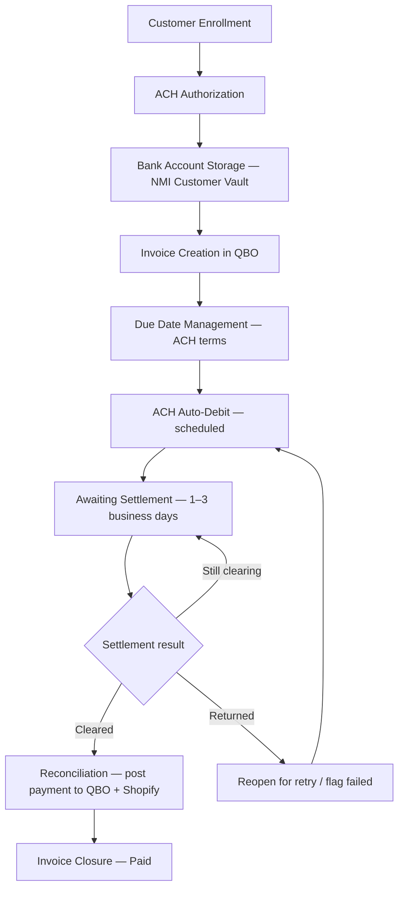

# ACH Payment Automation – Feasibility Analysis and Implementation Approach

**Prepared for:** Natural Solutions (Wholesale Program) — stakeholder review
**Scope:** Automated ACH (bank-debit) payment collection only. Card and Check
methods are referenced solely where they are a dependency (e.g. the card
"backup" method).
**Companion document:** `INTEGRATIONS.md` (full Shopify → QBO → NMI technical pipeline).

> **How to read this document:** it is written for business stakeholders, with
> enough technical detail for an implementation review. Where a statement needs
> your confirmation, it is flagged **[Client confirmation needed]**.

---

## 1. Executive Summary

### What ACH automation is

ACH automation collects wholesale invoice payments **directly from a customer's
bank account**, on a schedule, with no manual processing. The customer enrolls
their bank details once; the system then debits each invoice automatically and
keeps QuickBooks Online (QBO) and Shopify in sync.

### Business benefits

- **Lower cost per transaction** — ACH fees are typically far below card fees.
- **No manual collection effort** — invoices are debited automatically on terms.
- **Predictable cash flow** — scheduled debits on defined due dates.
- **Accurate books** — payments post to QBO only when funds actually clear.
- **Customer convenience** — enroll once, no repeated payment entry.

### High-level approach

The platform already integrates Shopify (orders), NMI (payment gateway), and QBO
(accounting). ACH automation extends that pipeline with a **deferred-settlement
model**: a bank debit is *submitted*, tracked as "awaiting settlement" for the
1–3 business day clearing window, and only posted as paid once the bank confirms
— protecting the business from recording revenue that later bounces.

> **Feasibility verdict: GO.** ACH automation is feasible on the existing stack
> with no technical or integration blocker. The work divides into a safe-core
> foundation plus compliance/experience hardening, delivered in phases.

---

## 2. Current State

### Existing payment workflow

A new Shopify order automatically creates a QBO invoice and is collected through
NMI. The system already supports three payment methods — **Card, ACH, and
Check** — locked per invoice at creation. A background scheduler drives
automated collection for the methods that support it.

### Current NMI integration status

NMI is integrated via its **Direct Post API**:

- `transact.php` — payment and vault operations (charges, vault creation).
- `query.php` — read operations (transaction status, vault lookup).

Environment is selected by configuration (sandbox vs. production); the gateway
rejects cross-environment calls, and the system asserts the correct pairing at
startup.

### Current ACH capabilities available in the system

The following ACH capabilities are present in the platform today:

| Capability | Available |
|---|---|
| NMI Customer Vault creation with an ACH (bank) profile | ✅ |
| Storing only a secure vault reference + last 4 (never the full account number) | ✅ |
| ACH debit (sale) against the stored vault | ✅ |
| "Awaiting settlement" tracking (funds not posted until cleared) | ✅ |
| Settlement status polling via NMI | ✅ |
| Returns → reopen for retry or flag failed | ✅ (uniform — see §6) |
| Scheduled auto-debit + reconciliation passes | ✅ |
| Admin fallback to the customer's backup card | ✅ |

> **Note:** the building blocks for ACH automation exist; the focus of the
> implementation roadmap (§8) is to **harden** the compliance, return-handling,
> and notification aspects to production grade — not to build from scratch.

---

## 3. Proposed ACH Automation Flow

The complete lifecycle:

```text
Customer Enrollment
        ↓
ACH Authorization
        ↓
Bank Account Storage (Customer Vault)
        ↓
Invoice Creation
        ↓
Due Date Management
        ↓
ACH Auto-Debit Processing
        ↓
Settlement Monitoring
        ↓
Reconciliation
        ↓
Invoice Closure
```

**As a visual flow:**



| Stage | What happens |
|---|---|
| **Customer Enrollment** | Customer selects ACH and provides bank details at registration. |
| **ACH Authorization** | Customer signs and accepts terms authorizing debits. |
| **Bank Account Storage** | Details are vaulted at NMI; only a token + last 4 are kept. |
| **Invoice Creation** | Each order creates a QBO invoice tagged ACH. |
| **Due Date Management** | Due date = order date + ACH term (configurable). |
| **ACH Auto-Debit** | Scheduler submits the debit to NMI on eligible invoices. |
| **Settlement Monitoring** | System polls NMI until the debit clears or returns. |
| **Reconciliation** | On clearing, payment posts to QBO + Shopify; gaps self-heal. |
| **Invoice Closure** | Invoice marked Paid once funds are confirmed. |

---

## 4. NMI ACH APIs Used

> Security keys are auto-injected and **masked** in all examples. NMI uses
> form-encoded requests; `query.php` returns XML.

### 4.1 Customer Vault creation (with ACH bank profile)

- **Endpoint:** `POST https://secure.nmi.com/api/transact.php`
- **Purpose:** Create a secure vault storing the customer's bank account so it
  can be debited later without re-collecting details.

**Sample payload**
```
security_key=***
customer_vault=add_customer
first_name=Jane&last_name=Doe&company=Acme Wholesale&phone=5551234567
payment=check
checkname=Jane Doe
checkaba=021000021          # 9-digit routing number
checkaccount=123456789      # account number (sent once, never stored by us)
account_type=checking       # checking | savings
billing_id=ach-1
```

**Sample response**
```
response=1&responsetext=Customer Added&customer_vault_id=1234567890&response_code=100
```

### 4.2 ACH payment-method storage (add a profile to an existing vault)

- **Endpoint:** `POST https://secure.nmi.com/api/transact.php`
- **Purpose:** Store an additional billing profile in an existing vault — used to
  attach the **backup card** to an ACH customer's vault (or vice versa).

**Sample payload**
```
security_key=***
customer_vault=add_billing
customer_vault_id=1234567890
billing_id=card-2
payment=creditcard
payment_token=<tokenized card from hosted field>
```

**Sample response**
```
response=1&responsetext=Customer Update Successful&customer_vault_id=1234567890&response_code=100
```

### 4.3 ACH sale / debit transaction

- **Endpoint:** `POST https://secure.nmi.com/api/transact.php`
- **Purpose:** Debit the customer's stored bank account for an invoice amount.

**Sample payload**
```
security_key=***
type=sale
customer_vault_id=1234567890
billing_id=ach-1           # target the ACH profile inside the vault
amount=505.00
currency=USD
orderid=WS-1042
order_description=Invoice 2026-0142
```

**Sample response (accepted — not yet settled)**
```
response=1&responsetext=Approved&authcode=...&transactionid=9876543210&response_code=100
```

> For ACH, `response_code=100` means **submitted to the bank network**, *not*
> settled. Settlement is confirmed later via §4.4.

### 4.4 Transaction status lookup (settlement check)

- **Endpoint:** `POST https://secure.nmi.com/api/query.php`
- **Purpose:** Check the current condition of a submitted ACH debit to determine
  whether it has cleared, returned, or is still settling.

**Sample payload**
```
security_key=***
transaction_id=9876543210
```

**Sample response (XML, abbreviated)**
```xml
<nm_response>
  <transaction>
    <transaction_id>9876543210</transaction_id>
    <transaction_type>ck</transaction_type>   <!-- ck = ACH/check -->
    <condition>pendingsettlement</condition>  <!-- clearing in progress -->
    <action>
      <action_type>sale</action_type>
      <amount>505.00</amount>
      <success>1</success>
      <response_code>100</response_code>
    </action>
  </transaction>
</nm_response>
```

The `condition` field drives the lifecycle:

| `condition` | Meaning | System action |
|---|---|---|
| `pendingsettlement` / `pending` | Still clearing | Keep waiting |
| `complete` | Funds cleared | Post payment, close invoice |
| `failed` / `canceled` | Returned | Reopen for retry or flag failed |

### 4.5 Settlement / reconciliation APIs

> **[Client confirmation / note]** NMI does **not** expose a dedicated
> "settlement webhook" or settlement-batch API in this integration. Settlement
> is determined by **polling the transaction status** (§4.4) until the
> `condition` resolves to `complete` or `failed`. For reporting/reconciliation,
> the transaction-report query (`query.php?report_type=transaction` with a date
> window) lists transactions and their conditions. If real-time settlement
> notifications are required, that would be a future enhancement
> (webhook-based), pending NMI account capabilities.

---

## 5. ACH Automation Process

### How ACH payment methods are collected and stored

At registration, the customer chooses ACH and enters their account holder name,
routing number (validated in real time), account number, and account type. The
details are sent to NMI to create the vault; **only a secure reference token and
the last 4 digits are stored** in our system — the full account number is never
retained.

### How customer authorization is captured

The customer **signs** (drawn or typed) and **accepts Terms & Conditions** at
enrollment, authorizing debits to the account on file. **[Client confirmation
needed]** For full NACHA alignment, we recommend adding ACH-specific
authorization language and a self-service revocation option (see §7).

### How invoices become eligible for ACH collection

An invoice is eligible for automated debit when **all** are true:

- It is unpaid.
- Its payment method is ACH.
- Automated collection is not paused for it (admin control).
- It has not exhausted its retry budget.
- The stored vault is valid and not already mid-settlement.

### How scheduled CRON jobs initiate ACH debits

A recurring scheduler runs the collection cycle. On each run it selects eligible
ACH invoices and submits the debit to NMI (§4.3). The proposed production
cadence is **twice monthly** (e.g. the 15th and last day), configurable; a
faster cadence is used for testing. **[Client confirmation needed]** on the
preferred production schedule.

### How successful and failed transactions are handled

- **Accepted:** invoice moves to **Awaiting Settlement**; the amount is held
  in-flight and is **not** posted to QBO yet.
- **Declined/error at submission:** the attempt is logged; the invoice remains
  pending and is retried on the next cycle (until the retry cap).
- **Returned after settlement window:** see §6.

---

## 6. Settlement & Return Handling

### ACH processing timelines

ACH is not instant. After submission, funds typically clear in **1–3 business
days**. The system reflects this with a dedicated **Awaiting Settlement** status
during the window.

### Pending Settlement status

While awaiting settlement, the invoice is neither "paid" nor "failed." The
submitted amount is tracked separately ("in-flight") and is only converted to a
recorded payment once the bank confirms. This is the core safeguard against
recording revenue that later bounces.

### Common ACH return scenarios & codes

When a debit bounces, the bank returns it with a NACHA **return code**:

| Code | Meaning | Typical cause |
|---|---|---|
| **R01** | Insufficient Funds | Not enough money at debit time (temporary) |
| **R02** | Account Closed | Account no longer exists |
| **R03** | No Account / Unable to Locate | Account not found |
| **R04** | Invalid Account Number | Account number is wrong |
| **R08** | Payment Stopped | Customer placed a stop payment |
| **R10 / R29** | Not Authorized | Customer/Corporate states debit unauthorized |

### Impact on invoices and customer accounts

| Return type | Invoice impact | Customer impact | Recommended handling |
|---|---|---|---|
| **R01 (NSF)** | Reopened for retry | Notified; debit re-attempted later | Retry after a few days (within NACHA limits) |
| **R02 / R03 / R04** | Marked failed | Asked to update bank details | Stop retrying; use card backup or re-collect |
| **R08** | Marked failed | Contacted | Stop; resolve stop-payment with customer |
| **R10 / R29** | Marked failed + flagged | Contacted | Halt all ACH; re-obtain authorization |

> **Current limitation [see §7]:** today the system treats returns *uniformly*
> (retry until the cap) and does not yet branch on the specific return code.
> Implementing return-code-aware handling is the top hardening recommendation.

---

## 7. Risks, Dependencies & Blockers

| Area | Consideration | Type |
|---|---|---|
| **Customer authorization** | NACHA-compliant, versioned authorization + revocation recommended beyond the current signature/T&C. | Compliance — **[client confirmation needed]** |
| **Bank account verification** | No micro-deposit / instant verification today; first-debit returns serve as de-facto verification. Optional provider (e.g. Plaid) reduces returns. | Optional enhancement |
| **ACH return risk** | Returns are normal; return-code-aware handling + monitoring of NACHA return-rate thresholds is recommended. | Operational/compliance |
| **Settlement delays** | 1–3 business day clearing means "paid" is delayed vs. card; stakeholders/customers must expect this. | Expectation-setting |
| **NMI processor limitations** | Settlement is determined by **polling** transaction status — no dedicated settlement webhook in this integration. Account-level ACH limits/holds may apply. | Dependency — **[client confirmation needed]** |
| **Operational dependencies** | Reliable scheduler; NMI + QBO API availability (self-healing reconciliation mitigates transient outages); approved authorization language from legal. | Operational |
| **Double-debit safety** | Prevented via single-worker scheduling + idempotency; must be preserved in any scaling. | Technical control |

**No item above is a feasibility blocker** — each has a clear mitigation built
into the roadmap.

---

## 8. Recommended Implementation Plan

A phased approach with clear milestones and deliverables:

### Phase 1 — Safe Core (foundation)
**Goal:** collect ACH automatically and safely.
**Deliverables:** enrollment + vault storage, ACH invoice creation with due-date
terms, scheduled auto-debit, deferred-settlement tracking, settlement polling,
settlement-gated posting to QBO/Shopify, idempotency safeguards.
**Milestone:** an ACH invoice is debited automatically and marked Paid only
after the bank confirms.

### Phase 2 — Correctness & Compliance (gate before scaling volume)
**Goal:** handle returns and authorization to production/NACHA standard.
**Deliverables:** return-code-aware retry/stop logic; retry spacing aligned to
NACHA re-presentment limits; NACHA-compliant authorization capture + revocation.
**Milestone:** returns are handled per code; authorization is defensible.

### Phase 3 — Visibility & Experience
**Goal:** keep customers and operators informed; enable audit.
**Deliverables:** ACH customer notifications (submitted / cleared / returned);
admin tooling (pause/resume, card fallback, manual receipt, retry); return-rate
monitoring + a daily reconciliation report.
**Milestone:** full operational visibility and customer communication.

### Phase 4 — Optional Hardening
**Goal:** reduce first-debit failures.
**Deliverable:** bank-account pre-verification at enrollment (third-party).
**Milestone:** verified accounts before first debit.

### Indicative effort (T-shirt sizing — confirm with delivery team)

| Phase | Size |
|---|---|
| Phase 1 — Safe Core | L |
| Phase 2 — Correctness & Compliance | M |
| Phase 3 — Visibility & Experience | M |
| Phase 4 — Optional verification | M–L |

*S ≈ days · M ≈ 1–2 weeks · L ≈ multi-week. Estimates are indicative and should
be confirmed against current team capacity before scheduling.*

---

## 9. Conclusion

ACH payment automation is **feasible** on the existing Shopify → QBO → NMI
platform, which already provides the essential building blocks (vault storage,
ACH debit, settlement tracking, scheduling). The defining ACH risk — the 1–3 day
settlement delay — is addressed by design through a deferred-settlement model
that posts payments only when funds clear.

- **Implementation effort:** moderate and well-bounded; phased delivery with a
  safe core first.
- **Key risks:** return handling and NACHA authorization (addressed in Phase 2),
  plus settlement-delay expectation-setting and the polling-based settlement
  model (no NMI settlement webhook).
- **Recommendation:** **Proceed.** Deliver Phase 1 (safe core), then treat
  Phase 2 (correctness + compliance) as the gate before scaling ACH volume, with
  Phases 3–4 enhancing visibility and reducing failures.

### Assumptions
- NMI remains the gateway for bank-account storage and ACH submission.
- QBO remains the financial book of record.
- A reliable scheduler is available for recurring jobs.
- Customers provide accurate bank details at enrollment.

